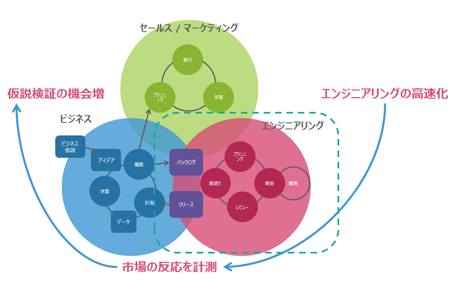

# サービス開発手法

## サービス開発の考え方

> **Note**: ビジネス的な仮説の検証速度を向上させるために、サービスを高速に市場投入することが重要と考えている、ということを記載する。

## このドキュメントについて

> **Note**: 上記の考え方に基づいて、このドキュメント（施策）が、リードタイムの短縮/サービス開発に集中できる環境の提供を目的としていることを記載する。

## サービス開発のフロー

> **Note**: 仮説検証サイクルと開発サイクルを図示する。
> * 仮説検証サイクル 
> * 開発サイクルの図のイメージ: https://www.ntt-tx.co.jp/column/assets_c/2017/03/image0-15223.html

## 開発時の協業イメージ

> **Note**: 協業PJと、Keel（導入支援、技術支援）, Canal（全社への質問）, Advisory Team（技術支援）, Fintan（スクラム開発）, NoP（開発環境）との関連について図示する。

## ステータス

> **Note**: 上記フローのうち、どこまでがドキュメントとして記載されているか、ということを図示する。記載範囲外は、導入支援・技術支援として支援していく、ということを記載する。

> **Note**: α版（Fintanでいうステージ0）であることを記載する。

## コンテンツ

### チームマネジメント

> **Note**: Fintanのスクラム関連コンテンツにリンクする。

### 開発環境

> **Note**: NoPにリンクする。

### 開発ガイド

> **Note**: 現在作成中のドキュメント

### 運用ガイド

> **Note**: サービス運用の観点からのガイド。今後作成することを記載する。