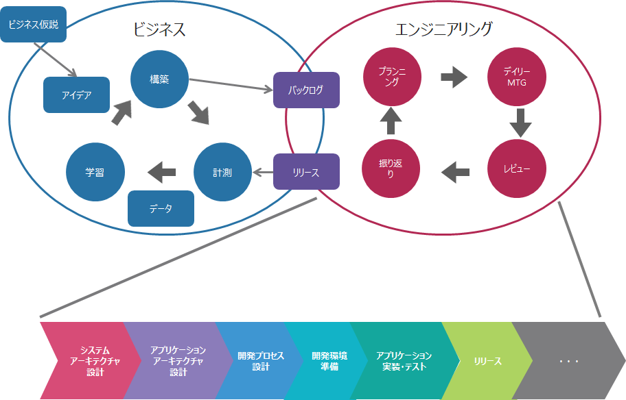

# サービス開発のエンジニアリングガイド

* [はじめに](#はじめに)
* [サービス開発の考え方](#サービス開発の考え方)
* [エンジニアを育成する](#エンジニアを育成する)
* [システムアーキテクチャを設計する](#システムアーキテクチャを設計する)
* [アプリケーションアーキテクチャを設計する](#アプリケーションアーキテクチャを設計する)
* [開発プロセスを設計する](#開発プロセスを設計する)
* [開発環境を準備する](#開発環境を準備する)
* [テスト環境と本番環境を用意する](#テスト環境と本番環境を用意する)
* [テストを計画する](#テストを計画する)
* [アプリケーションを実装・テストする](#アプリケーションを実装テストする)
* [サービスをリリースする](#サービスをリリースする)
* [サービスを運用する](#サービスを運用する)

## はじめに

このドキュメントは、サービス開発のエンジニアリング部分を担うエンジニアに対して、開発開始前・開発中になにをすべきか、なにを参照すれば良いかを示すものです。サービス開発に必要と考えているアクティビティについて、現時点で最適と考えている進め方を記載しています。プロジェクトのメンバースキルや文化に強く依存するため、ここでは開発プロセスを定めていません。

サービスの開発開始前にこのドキュメントを一通り確認して、開発をどのように進めるか検討してください。

### このドキュメントの対象読者

サービス開発のエンジニアリング部分を始めようとしているエンジニアや、実際にサービス開発を進めているエンジニアを対象としています。

## サービス開発の考え方

サービス型ビジネスモデルにおいては、変化が速く不確実で予測困難な市場に対して、ビジネス面の仮説検証サイクルを繰り返し、市場の反応を見ながらサービスを改善して付加価値を高めていくことが重要になります。

このようなモデルでは、サービスの成功にはビジネス仮説の検証機会を増加させることが必要となりますが、そのためには、いかにしてビジネス仮説から市場へのローンチまでにかかる時間（リードタイム）を短縮するかが鍵になってきます。

> **仮説検証サイクル**
>
> 

## エンジニアを育成する

創造的なサービス開発において、開発チームは自己組織化されたチームであることが求められます。つまり、自分たちで、自分たちにとって最適のやり方を選択し、サービスの付加価値を高めていくことが求められます。

そのためには、サービス開発のチームを構成するとき、開発メンバーは機能横断的であり、チームとしてフルスタックのスキルをカバーするように構成するのが望ましいです。特に、個々のメンバーはT字型のスキルを持ち、継続的に必要なスキルセットを獲得していく必要があります。

社内におけるフルスタックエンジニアを育成するための取り組みを以下に公開しています。

* [Fintan - フルスタックエンジニア育成に関する取り組み](https://fintan.jp/?p=1273)

## システムアーキテクチャを設計する

まずは今から構築するサービスを俯瞰し、全体がどのように構成されるのかを設計・可視化することで、サービスのシステム的な側面についてチームの認識を合わせることができるようになります。

サービス開発で実際に採用したシステムアーキテクチャの事例を以下に公開しています。

* [Fintan - SPA＋REST APIのシステム構成例（AWS）](https://fintan.jp/?p=1256)
* [Fintan - モニタリング、監視、ログ収集の実践例（AWS）](https://fintan.jp/?p=1266)

## アプリケーションアーキテクチャを設計する

クラウドネイティブなアプリケーションアーキテクチャを採用することで、サービス開発のプラットフォームを利用してクラウドのメリットを十分に生かすことができます。

クラウドネイティブなアプリケーションアーキテクチャについては、次のリンク先を参照してください。

* [クラウドネイティブなアプリケーションの開発](application-development.md)

また、構築するアプリケーションの特徴に合わせて、利用するアプリケーションフレームワークも決定する必要があります。Fintanの[Springアプリ開発ノウハウ集](https://fintan.jp/?p=969)では、広いエコシステムを持ち、クラウドサービスとの連携も充実している[Spring](https://spring.io/)についてのノウハウをまとめています。

* [Fintan - Springアプリ開発ノウハウ集](https://fintan.jp/?p=969)

## 開発プロセスを設計する

サービスの開発では、市場に投入してフィードバックに基づいて改善する、というサイクルを頻繁に回していくことが重要です。

そのため、漸次的にアプリケーションを作り上げていくスクラムのような開発プロセスが好ましいです。

スクラムに関しては、Fintanのスクラム関連のコンテンツを参照してください。

* [Fintan - スクラム関連コンテンツ](https://fintan.jp/?tag=%E3%82%B9%E3%82%AF%E3%83%A9%E3%83%A0%E9%96%8B%E7%99%BA)

## 開発環境を準備する

サービスを開発するチームにとって、チケット管理（かんばん）やGitリポジトリ、CIツール、チャットは必要不可欠なツールです。これらのツールが含まれた環境を素早く構築できる、Collaborageというテンプレートを公開しています。

* [Fintan - Collaborage（チーム開発環境構築テンプレート）](https://fintan.jp/?p=335)

また、クラウド環境上で提供されているCIサービスを活用して、CIを実践した事例を以下に公開しています。

* [Fintan - AWSの開発者用ツールを活用したCI/CD構成例](https://fintan.jp/?p=1334)

* [Fintan - Azure DevOpsを活用したCI（ビルドパイプライン）の構築例](https://fintan.jp/?p=1339)

## テスト環境と本番環境を用意する

「エンジニアリングの高速化」を実現するため、サービスを開発するエンジニアがアプリケーション開発に集中できる環境を整備することが重要です。

そのために、クラウドのサービスを活用し、環境構築の時間短縮や運用負荷の軽減を行います。

今後、クラウドを活用したテスト環境と本番環境の構成事例を公開していく予定です。

## テストを計画する

アプリケーションに対して何をどこまでテストすればリリースできるのかを検討することは、リスクに見合わない過剰な投資を避けるなど、サービスのROIを高めることに役立ちます。また、リリースのための基準を設けることで、開発を進めやすくなる側面もあります。

そして、何をどこまでテストするかを決めたら、開発プロセスの中でいつどうやってテストしていくのかを計画します。そうすることで、アプリケーションの品質をどのように作りこむのか、見通すことができるようになります。

テストを計画するにあたっての詳細は、Fintanのテスト関連のコンテンツを参照してください。

* [Fintan - テスト関連コンテンツ](https://fintan.jp/?tag=%E3%83%86%E3%82%B9%E3%83%88)

## アプリケーションを実装・テストする

サービス開発では継続的で頻繁な市場投入とフィードバックの獲得が重要とされるため、アプリケーションを頻繁にリリースする必要があります。

この際に、手動でのリグレッションテストは、往々にして以降の継続的なリリースにおいてボトルネックとなります。そのため、例えば重要な一部の機能だけはリグレッションテストを自動化して最低限の品質を担保し、リリースの頻度を下げないようにするなどの対応が必要になります。

また、テスト自動化の実践例を以下に公開しています。

* [Fintan - 結合テスト自動化事例](https://fintan.jp/?p=1172)
* [Fintan - 性能テスト自動化事例](https://fintan.jp/?p=1216)

テストだけでなく、実装についてもサービス開発などを通じて得られるノウハウを整理し、「ノウハウ集」に集約することでプロジェクトやグループ全体が活用しやすい情報にしていきます。現在は、以下のノウハウ集がFintanで公開されています。

* [Fintan - Springアプリ開発ノウハウ集](https://fintan.jp/?p=969)

## サービスをリリースする

サービスをリリースするときには、安全で確実なリリースが求められますが、簡単に実現できることではありません。

今後、サービスの安全で確実なリリースを支援するための仕組みを公開する予定です。

## サービスを運用する

サービスを市場に投入した後は、例えばアクティブユーザー数や、ページビュー数などの指標値を利用して市場からのフィードバックを観測します。そういったフィードバックを受けて、次の改善の優先順位を判断することになるため、指標値を可視化していつでも確認できるようにすることが望ましいです。

今後、指標値を簡単に確認できるようにする仕組みを公開する予定です。

## License

 このドキュメントは<a rel="license" href="http://creativecommons.org/licenses/by-sa/4.0/">クリエイティブ・コモンズ 表示 - 継承 4.0 国際 ライセンス</a>の下に提供されています。
