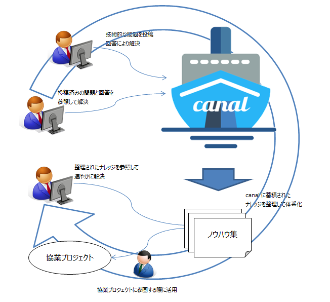

# クラウド前提のアプリケーション開発

クラウドネイティブなアプリケーションのアーキテクチャについては、以下を参照してください。

* [The Twelve-Factor App](https://12factor.net/ja/)
* [Beyond the 12 Factor App](https://content.pivotal.io/ebooks/beyond-the-12-factor-app)
* [クラウドネイティブ成熟度モデル](https://www.slideshare.net/Pivotal/the-cloud-native-journey-58445711)（到達レベル：Cloud Resilient）
* [クラウドネイティブなアプリケーション — Macchinetta Server Framework Cloud Extension Development Guideline](https://macchinetta.github.io/cloud-guideline/1.0.1.RELEASE/ja/Overview/CloudNativeApplication.html)

TIS で実績の多い Java 開発でクラウドネイティブなアプリケーション開発を行う場合、エコシステムやクラウドサービス連携等を鑑みて、以下のアプリケーションスタックを推奨します。

* Spring Boot
  * Thymeleaf
* Spring Cloud
* Doma2
* Flyway

Spring については、以下を参照してください。

* [Getting Started · Building an Application with Spring Boot](https://spring.io/guides/gs/spring-boot/)
* [はじめての Spring Boot[改訂版]](https://www.kohgakusha.co.jp/books/detail/978-4-7775-1969-9)
* [Spring徹底入門 Spring FrameworkによるJavaアプリケーション開発（株式会社NTTデータ）｜翔泳社の本](https://www.shoeisha.co.jp/book/detail/9784798142470)

上記のスタックでアプリケーションを開発する際のナレッジとしては、[ノウハウ集](https://ci.keel-dev.net/doc/crib-notes-build/branches/develop/lastSuccessful/archive/doc/_build/html/index.html) を参照してください。

TDD では、技術支援・Q&Aサービス『[canal](http://canal.intra.tis.co.jp/about)』を展開しており、canal に蓄積されたナレッジ（技術的な問題と解決策）をノウハウ集として整理し、協業プロジェクトや社外（グループ会社含む）で活用していきます。

> 
